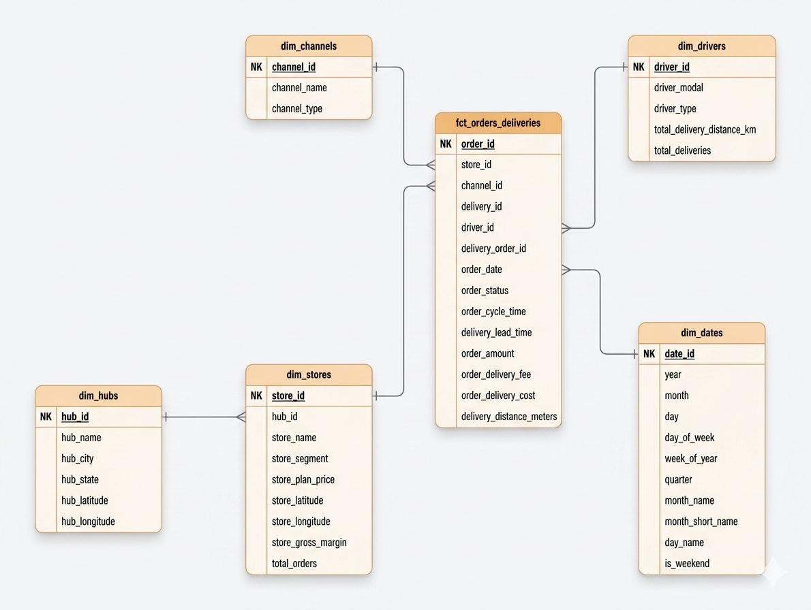
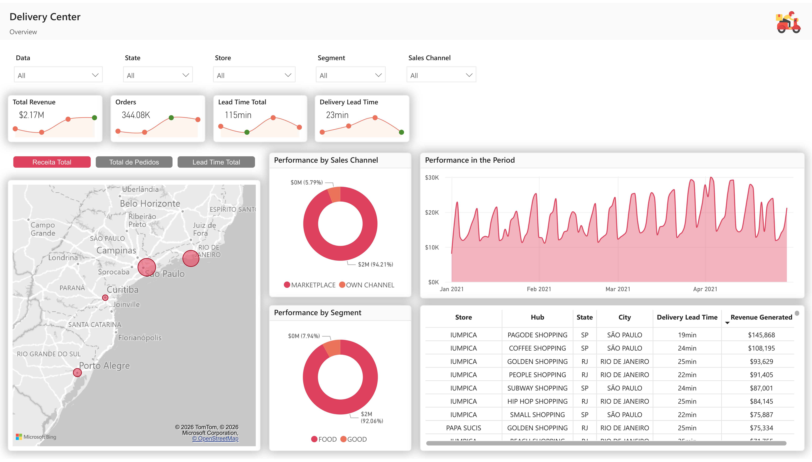

# 🛵 Building a Data Warehouse for Delivery Center


### 📜 Summary
1. 📌 [About the Project](#-about-the-project)
2. ⚙️ [Technologies Used](#️-technologies-used)
3. 🚀 [How to Run](#-how-to-run)
4. 📊 [Project Structure](#-project-structure)
5. 🗒️ [License](#️-license)
6. 📞 [Contact](#-contact)

## 📌 About the Project
With its various operational hubs spread across Brazil, Delivery Center is a platform that integrates retailers and marketplaces, creating a healthy ecosystem for sales of goods (products) and food (meals) in the Brazilian retail sector.

Currently, we have a catalog (catalog + menu) with more than 900 thousand items, thousands of orders and deliveries are operationalized daily with a network of thousands of partner retailers and deliverers spread across all regions of the country.

The project uses the **medallion** architecture (bronze, silver, gold) to organize these data in layers according to their quality and level of aggregation:
- **Bronze**: Raw data loaded directly from CSV files.
- **Silver**: Clean, standardized, and related data.
- **Gold**: Analytical tables and metrics ready for consumption in BI or dashboards.


##### Entity Relationship Diagram



##### Power BI Dashboard

>[Access on Power BI Service](https://app.powerbi.com/view?r=eyJrIjoiMTRhNjM4NDMtOGU4YS00MzA1LTkyMTYtNjkxOGNhMTk3MGM5IiwidCI6ImFkYjQ5MjVhLTlhMzUtNDQ5MC05OGIwLTY2ZGY2MWFlZWY2MiIsImMiOjEwfQ%3D%3D)

## ⚙️ Technologies Used
- 🐍 **Python** (Pandas, SQLAlchemy)
- 🐘 **PostgreSQL** (Relational database)
- 🪛 **dbt (data build tool)** (Data modeling and transformation)

## 🚀 How to Run

##### Clone the repository
```bash
git clone https://github.com/HarlH/data_warehourse_delivery.git
cd data_warehourse_delivery/
```
##### Install dependencies
```bash
pip install -r requirements.txt
```
##### Configure the Database
Create a `.env` file in the project root with your credentials, and adjust your dbt `profiles.yml`.
```plaintext
DB_USER=your_user
DB_PASSWORD=your_password
DB_HOST=localhost
DB_NAME=your_database
```
##### Run the ingestion script
```bash
python src/data_ingestion.py
```
##### Run the dbt models
```bash
cd dwh/
dbt run
```
##### Run tests (optional)
```bash
dbt test
```
##### Generate documentation (optional)
```bash
dbt docs generate
dbt docs serve
```
## 📊 Project Structure

```plaintext
deliverycenter_dwh/
├── dashboard/              # Power BI dashboard in .pbip
├── data/
|   └── raw/                # Raw CSV files
├── dwh/                    # dbt project
├── img/
|   └── arq.png             # DWH Architecture Diagram
|   └── erdiagram.png       # Entity Relationship Diagram
├── src/
|   └── data_ingestion.py   # Data ingestion script
├── .gitignore              # Ignored files and folders
├── LICENSE.md              # Project license
├── poetry.lock             # Poetry lock file
├── pyproject.toml          # Poetry project
├── README.md               # Repository readme
└── requirements.txt        # Dependencies
```

## 🗒️ License
This project is licensed under the MIT License - see the [LICENSE](LICENSE.md) file for more details.

## 📞 Contact
- 📬 lengocbaochan@gmail.com
- 🖱️ 